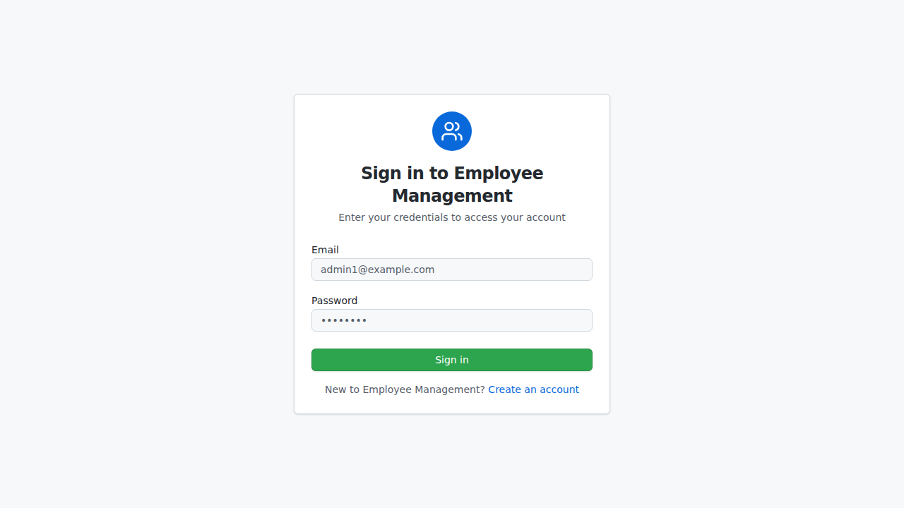
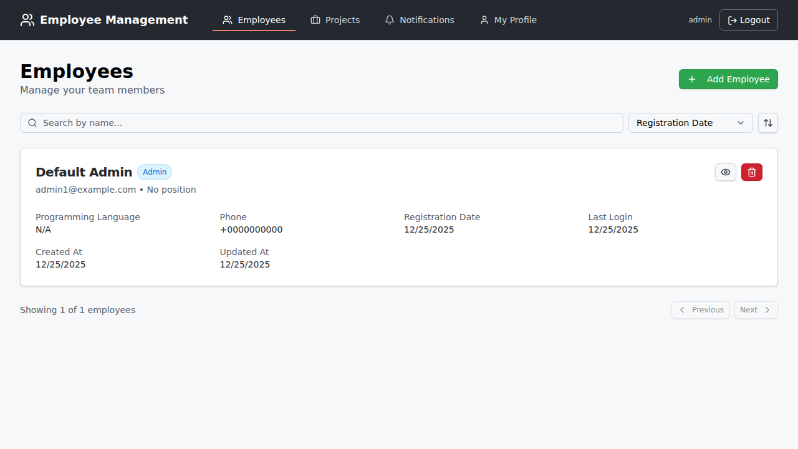
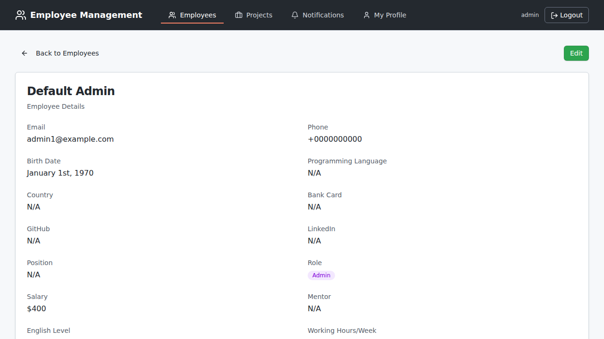
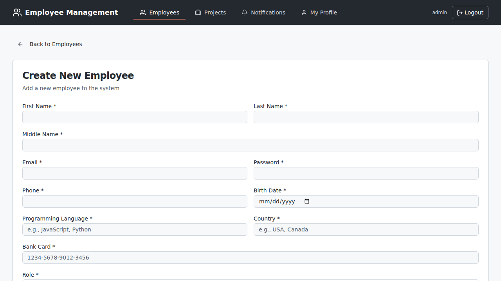
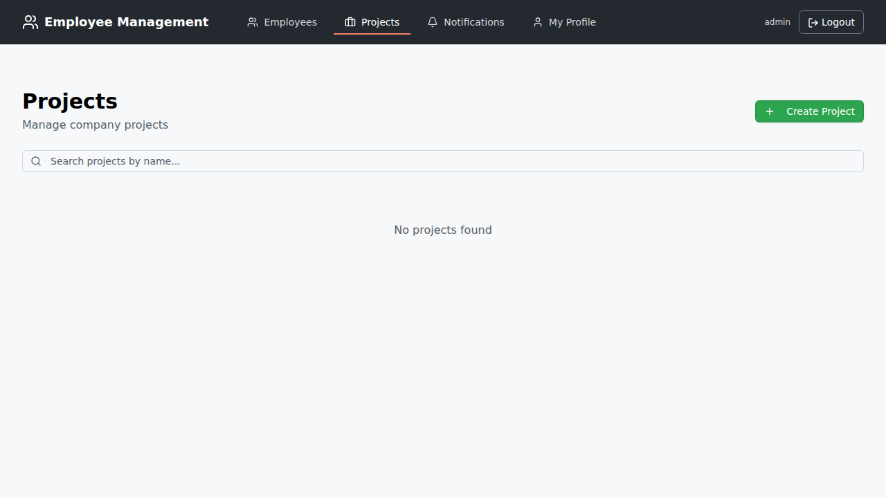

# Employee Management System

A full-stack employee management system with a RESTful API backend and a modern React frontend, designed to support organizational employee management with PostgreSQL as the database.

## Repository Structure

```
employee-management-api/
├── frontend/           # React frontend application
├── backend/           # Node.js API (root level)
├── docker-compose.yml # Docker orchestration for full stack
└── README.md         # This file
```

## Application Overview

This application is an employee management system designed for administrators and company employees. Administrators can add new employees, edit their data, assign positions, manage salary levels, and view salary increase histories. The system now includes comprehensive project management capabilities, allowing administrators to create and manage projects, assign multiple projects to employees, and track project status. The application automatically tracks salary raise dates for employees and sends notifications to administrators one month before the scheduled increase. Additionally, the system sends notifications about upcoming employee birthdays to help administrators congratulate employees on time.

Employees can update their personal information, such as name, contact details, and programming languages, while certain fields, like salary or position, are editable only by administrators. Employees can be assigned to multiple projects simultaneously, with project information visible on their profiles. All changes to employee profiles are automatically logged, and notifications are sent to administrators. Notifications also include employee status updates, such as assigned projects or English language proficiency. The application ensures regular data checks and sends important notifications through a task scheduler.

## Features

### Backend API
- **Employee Management**: Create, read, update, and delete employee records.
- **Project Management**: Full CRUD operations for projects with many-to-many employee-project relationships.
- **Data Validation**: Ensures data integrity with robust validation and input sanitization.
- **Search and Filter**: Allows filtering employees and projects by various criteria.
- **Pagination**: Supports paginated employee and project listings.
- **Error Handling**: Comprehensive error management for reliability.
- **Authentication**: JWT-based authentication system with role-based access control.
- **Notifications**: Automated notification system for birthdays and salary reviews.
- **Transaction Support**: Database transactions for data consistency.

### Frontend Application
- **Modern UI**: Built with React, Vite, Shadcn UI, and Tailwind CSS.
- **Authentication**: Secure login and registration.
- **Employee Management**: View, create, edit, and delete employees.
- **Project Management**: Full CRUD interface for projects with role-based access control.
- **Employee-Project Assignment**: Assign multiple projects to employees with visual indicators.
- **Responsive Design**: Works on desktop, tablet, and mobile.
- **Real-time Updates**: Notifications and data updates.
- **Interactive Components**: Clickable project cards, modals, and dynamic forms.

## Screenshots

### Login Page


### Employee List


### Employee Detail


### Create Employee


### Projects Management


## Quick Start with GitHub Codespaces

The easiest way to get started is using GitHub Codespaces, which provides a fully configured development environment in the cloud.

### Prerequisites
- A GitHub account
- Access to GitHub Codespaces

### Setup

1. Click the **Code** button on the GitHub repository page
2. Select the **Codespaces** tab
3. Click **Create codespace on main** (or your preferred branch)

GitHub will automatically:
- Set up the development environment
- Configure port forwarding for ports 3000 (backend) and 5173 (frontend)
- Install VS Code extensions for linting and formatting

### Running the Application

Once your Codespace is ready:

1. Copy environment files:
   ```bash
   cp .env.example .env
   cp frontend/.env.example frontend/.env
   ```

2. Start all services with Docker Compose:
   ```bash
   docker compose --profile dev up
   ```

   This starts:
   - **PostgreSQL Database** (internal only)
   - **Backend API** on port 3000 (automatically forwarded)
   - **Frontend Application** on port 5173 (automatically forwarded)

3. Access the application:
   - GitHub Codespaces will automatically forward ports
   - Click on the "Ports" tab in VS Code to see forwarded ports
   - Open the frontend URL (port 5173) in your browser

**Default Admin Credentials:**
- Email: `admin1@example.com`
- Password: `adminpassword`

### Manual Setup in Codespaces (without Docker)

If you prefer to run services manually:

1. **Terminal 1 - Backend**:
   ```bash
   npm install
   npm run dev
   ```

2. **Terminal 2 - Frontend**:
   ```bash
   cd frontend
   npm install
   npm run dev
   ```

The backend runs on port 3000 and frontend on port 5173. Both ports are automatically forwarded by Codespaces.

### Troubleshooting in Codespaces

**Connection Refused Errors:**
- Ensure backend is running on port 3000 (check terminal output)
- Verify `.env` file exists with `PORT=3000`
- Check port 3000 is forwarded in the Ports tab
- Ensure `VITE_API_URL=http://localhost:3000` in `frontend/.env`

**CORS Errors:**
- Update `CORS_ORIGIN` in `.env` to match your Codespaces frontend URL
- Or set `CORS_ORIGIN=*` for development

For more details, see [.devcontainer/README.md](.devcontainer/README.md).

## Quick Start with Docker

The application uses Docker Compose with profile-based execution for different environments.

### Prerequisites
- Docker and Docker Compose installed
- Git (to clone the repository)

### Setup

1. Clone the repository and navigate to the project directory:
   ```bash
   git clone https://github.com/dreamquality/employee-management-api.git
   cd employee-management-api
   ```

2. Copy environment files:
   ```bash
   cp .env.example .env
   cp .env.test.example .env.test
   cp .env.e2e.example .env.e2e
   ```

3. (Optional) Update environment variables in `.env` files for your setup

### Running the Application

#### Development Mode (Recommended)
Start all services for local development:
```bash
docker compose --profile dev up
```

This starts:
- **PostgreSQL Database** (internal only - not exposed to host, accessible via `docker compose exec`)
- **Backend API** on port 3000
- **Frontend Application** on port 5173

Access the application at `http://localhost:5173`

**Default Admin Credentials:**
- Email: `admin1@example.com`
- Password: `adminpassword`

#### CI Testing Mode
Run automated tests (used in GitHub Actions):
```bash
docker compose --profile ci up --abort-on-container-exit --exit-code-from test
```

Clean up after tests:
```bash
docker compose --profile ci down -v
```

#### E2E Testing Mode
Run end-to-end tests (requires Playwright setup):
```bash
docker compose --profile e2e up --abort-on-container-exit --exit-code-from playwright
```

> Note: The `playwright` service in `docker-compose.yml` currently uses a placeholder command that exits with an error. Playwright is not configured by default. Before using the `e2e` profile, configure Playwright in the frontend and add a `test:e2e` script to `frontend/package.json` that runs your E2E tests. Until this is done, running the E2E profile will fail as expected.
### Docker Compose Profiles

The application supports three profiles for different use cases:

| Profile | Services | Use Case |
|---------|----------|----------|
| `dev` | app, frontend, db | Local development with hot reload |
| `ci` | app, db, test | Automated testing in CI/CD pipelines |
| `e2e` | app, frontend, db, playwright | End-to-end testing |

### Common Docker Commands

```bash
# Stop all services
docker compose down

# Stop and remove volumes (clean slate)
docker compose down -v

# View logs
docker compose logs -f

# View logs for specific service
docker compose logs -f app

# Access database
docker compose exec db psql -U postgres -d my_database

# Rebuild containers
docker compose build --no-cache
```

### Docker Architecture

The refactored Docker setup includes:

- **Isolated Networking**: Database is not exposed to host, services communicate via Docker network
- **Health Checks**: App service includes health check endpoint (`/health`) to ensure proper startup order
- **Environment Files**: All secrets and configuration in `.env` files (not committed to Git)
- **Entrypoint Scripts**: Migrations run automatically before app/tests start
- **Profile-Based**: Run only the services you need for your task

### Troubleshooting Docker

| Problem | Solution |
|---------|----------|
| "no configuration file provided" | Run: `cp .env.example .env` |
| Services don't start | Ensure you specify a profile: `--profile dev` |
| Can't connect to DB from host | DB is internal only, use: `docker compose exec db psql -U postgres` |
| Health check fails | Check logs: `docker compose logs app` |
| CORS errors in browser | Check `CORS_ORIGIN` in `.env` file |

### GitHub Actions Integration

The CI workflow automatically uses Docker Compose:

```yaml
- name: Setup environment files
  run: |
    cp .env.test.example .env.test
    cp .env.example .env

- name: Run tests with Docker Compose
  run: |
    docker compose --profile ci up --abort-on-container-exit --exit-code-from test
```

This ensures consistency between local development and CI environments.

## Manual Setup

### Backend API Setup

### Prerequisites

- **Node.js**: Install [Node.js](https://nodejs.org/) (version 18 or higher recommended).
- **npm**: Comes with Node.js but can be updated independently.
- **PostgreSQL**: Install and configure [PostgreSQL 16](https://www.postgresql.org/) as the database for employee data.

### Installation

1. Clone the repository:
   ```sh
   git clone https://github.com/dreamquality/employee-management-api.git
   ```
2. Navigate to the project directory:
   ```sh
   cd employee-management-api
   ```
3. Install dependencies:
   ```sh
   npm install
   ```

### Configuration

1. Create a `.env` file in the root of the project.
2. Add the following environment variables:
   ```plaintext
   # Локальная база данных
   DB_HOST=127.0.0.1
   DB_PORT=5432
   DB_NAME=employee_db
   DB_USER=your_local_db_user
   DB_PASSWORD=your_local_db_password

   # Секреты
   JWT_SECRET=your_jwt_secret
   SECRET_WORD=your_secret_word_for_admin_registration

   # Среда разработки
   NODE_ENV=development

   # Порт (опционально, по умолчанию 3000)
   PORT=3000
   ```
   - `DB_HOST`, `DB_PORT`, `DB_NAME`, `DB_USER`, `DB_PASSWORD`: Данные для подключения к базе данных PostgreSQL.
   - `JWT_SECRET`: Секретный ключ для аутентификации JWT.
   - `SECRET_WORD`: Секретный ключ для регистрации администратора.
   - `NODE_ENV`: Указывает среду выполнения.
   - `PORT`: Порт, на котором будет работать сервер (по умолчанию 3000).

Замените `your_local_db_user`, `your_local_db_password`, `your_jwt_secret`, и `your_secret_word_for_admin_registration` на свои реальные значения.

### Running the Application

Start the server in development mode:
   ```sh
   npm run dev
   ```
The server will be running at `http://localhost:3000`.

### API Documentation

Access the interactive API documentation at [http://localhost:3000/api-docs](http://localhost:3000/api-docs) if Swagger or a similar tool is set up. This documentation provides a complete view of the available endpoints and allows for interactive testing.

### Frontend Setup

1. Navigate to the frontend directory:
   ```sh
   cd frontend
   ```

2. Install frontend dependencies:
   ```sh
   npm install
   ```

3. Create a `.env` file in the frontend directory:
   ```sh
   cp .env.example .env
   ```

4. Update the `.env` file with the API URL:
   ```plaintext
   VITE_API_URL=http://localhost:3000
   ```

5. Start the frontend development server:
   ```sh
   npm run dev
   ```

The frontend will be available at `http://localhost:5173`.

For more details about the frontend, see the [frontend README](./frontend/README.md).

## Deployment

### Deploying to Render.com with Docker (Recommended)

This application is fully configured for deployment to Render using Docker containers and Infrastructure as Code via the `render.yaml` blueprint file. This is the **recommended and easiest method** for deployment.

#### Prerequisites

1. **Create a Render Account**: Sign up at [Render.com](https://render.com/)
2. **GitHub Repository**: Ensure your code is pushed to a GitHub repository
3. **Prepare Environment Variables**: Have your JWT secret and other configuration values ready

#### Quick Deploy with render.yaml (Infrastructure as Code)

The repository includes a `render.yaml` file that defines all infrastructure needed for the application. This allows you to deploy the entire stack with just a few clicks.

**Step 1: Fork or Push to Your GitHub Repository**

Ensure the code (including the `render.yaml` file) is in your GitHub repository.

**Step 2: Create New Blueprint Instance**

1. Log in to your [Render Dashboard](https://dashboard.render.com/)
2. Click **New +** and select **Blueprint**
3. Connect your GitHub repository
4. Select the repository containing the `render.yaml` file
5. Render will automatically detect the blueprint file

**Step 3: Review and Configure**

Render will show you the services that will be created:
- **employee-management-db**: PostgreSQL database (Free tier)
- **employee-management-api**: Backend API web service (Docker)
- **employee-management-frontend**: Frontend static site (Docker)

**Step 4: Set Environment Variables (Optional)**

The `render.yaml` file includes auto-generated secrets for `JWT_SECRET` and `SECRET_WORD`. You can:
- Keep the auto-generated values (recommended for production)
- Or override them in the Render dashboard after deployment

**Step 5: Deploy**

1. Click **Apply** to create all services
2. Render will:
   - Create the PostgreSQL database
   - Build and deploy the backend API using the root `Dockerfile`
   - Build and deploy the frontend using the `frontend/Dockerfile`
   - Run database migrations automatically via the entrypoint script
   - Connect all services together

3. Wait for all services to complete their first deployment (usually 5-10 minutes)

**Step 6: Access Your Application**

Once deployment is complete:
1. Find your frontend URL in the Render dashboard (e.g., `https://employee-management-frontend.onrender.com`)
2. Visit the URL in your browser
3. Log in with default admin credentials:
   - Email: `admin1@example.com`
   - Password: `adminpassword`

#### Important Configuration Notes

**Service Names**: If you want to customize service names, edit the `render.yaml` file before deployment:
```yaml
services:
  - type: web
    name: my-custom-api-name  # Change this
```

**Region**: The default region is `oregon`. You can change this in `render.yaml`:
```yaml
services:
  - type: web
    region: frankfurt  # or singapore, ohio, etc.
```

**CORS Configuration**: The backend's `CORS_ORIGIN` environment variable is pre-configured in `render.yaml` to point to the frontend service. If you change the frontend service name, update this value accordingly.

**Auto-Deploy**: The services are configured with `autoDeploy: true`, meaning every push to your `main` branch will trigger a new deployment.

#### What Happens During Deployment

1. **Database Setup**:
   - PostgreSQL 16 database is created
   - Connection URL is automatically passed to the backend service

2. **Backend Deployment**:
   - Docker image is built using the root `Dockerfile`
   - Dependencies are installed via `npm ci`
   - Non-root user is created for security
   - Entrypoint script runs database migrations automatically
   - Application starts on port 3000
   - Health check endpoint (`/health`) is monitored

3. **Frontend Deployment**:
   - Docker image is built using `frontend/Dockerfile` (multi-stage build)
   - Build stage: npm packages installed, Vite build runs with API URL
   - Production stage: Static files served via Nginx
   - Application runs on port 80

#### Post-Deployment Tasks

1. **Update Admin Password**:
   - Log in with the default credentials
   - Change the admin password immediately for security

2. **Configure Custom Domain** (Optional):
   - In Render dashboard, go to each service settings
   - Add your custom domain
   - Update CORS settings if using a custom domain

3. **Set up Monitoring**:
   - Enable email notifications for deployment failures
   - Monitor logs in the Render dashboard

4. **Database Backups** (Recommended for Production):
   - Upgrade from Free to Starter plan for automatic backups
   - Free tier databases are not backed up

#### Updating Your Deployment

To update your application:
1. Push changes to your GitHub repository
2. Render will automatically rebuild and redeploy (if autoDeploy is enabled)
3. Database migrations run automatically on each backend deployment

To manually trigger a deployment:
1. Go to the service in Render dashboard
2. Click **Manual Deploy** → **Deploy latest commit**

#### Environment Variables Reference

**Backend (`employee-management-api`)**:
- `NODE_ENV`: Set to `production`
- `PORT`: Set to `3000`
- `DATABASE_URL`: Auto-populated from database service
- `JWT_SECRET`: Auto-generated secure random string
- `SECRET_WORD`: Auto-generated secure random string (for admin registration)
- `CORS_ORIGIN`: Frontend URL for CORS configuration

**Frontend (`employee-management-frontend`)**:
- `VITE_API_URL`: Backend API URL (automatically configured in render.yaml)

#### Troubleshooting

**Build Failures**:
- Check the build logs in Render dashboard
- Ensure `Dockerfile` and `frontend/Dockerfile` are present
- Verify `package.json` files are correct

**Database Connection Issues**:
- Verify `DATABASE_URL` is automatically set by Render
- Check that database service is running and healthy
- Review backend logs for connection errors

**Frontend Not Connecting to Backend**:
- Verify `VITE_API_URL` environment variable is set correctly
- Check `CORS_ORIGIN` in backend matches frontend URL
- Ensure backend service is running and accessible

**Migration Failures**:
- Check backend service logs for migration errors
- Database migrations run automatically via `entrypoint.sh`
- Ensure database is accessible and credentials are correct

**Service Won't Start (Free Tier)**:
- Free tier services spin down after 15 minutes of inactivity
- First request after inactivity takes 30-50 seconds
- Consider upgrading to a paid plan for always-on services

For more help, refer to [Render's Blueprint documentation](https://render.com/docs/infrastructure-as-code) or check service logs in your Render dashboard.

---

### Alternative: Manual Deployment to Render.com

If you prefer to manually configure services without using the `render.yaml` blueprint, you can follow these steps. **Note**: The Docker/Blueprint method above is recommended as it's faster and less error-prone.

#### Prerequisites

1. **Create a Render Account**: Sign up at [Render.com](https://render.com/)
2. **GitHub Repository**: Ensure your code is pushed to a GitHub repository
3. **Prepare Environment Variables**: Have your JWT secret and other configuration values ready

#### Step 1: Deploy PostgreSQL Database

1. From your Render dashboard, click **New +** and select **PostgreSQL**
2. Configure your database:
   - **Name**: `employee-management-db` (or your preferred name)
   - **Database**: `employee_db`
   - **User**: Will be auto-generated
   - **Region**: Choose the closest region to your users
   - **Instance Type**: Select based on your needs (Free tier available)
3. Click **Create Database**
4. Once created, copy the **Internal Database URL** (it starts with `postgres://`)
5. Save this URL - you'll need it for the backend configuration

#### Step 2: Deploy Backend API with Docker

1. From your Render dashboard, click **New +** and select **Web Service**
2. Connect your GitHub repository
3. Configure the web service:
   - **Name**: `employee-management-api` (or your preferred name)
   - **Region**: Same as your database for better performance
   - **Branch**: `main` (or your production branch)
   - **Root Directory**: Leave empty (backend is at root level)
   - **Runtime**: `Docker`
   - **Dockerfile Path**: `./Dockerfile`
   - **Docker Context**: `.`
   - **Instance Type**: Select based on your needs (Free tier available)

4. **Add Environment Variables** (click "Advanced" or go to Environment tab):
   ```plaintext
   NODE_ENV=production
   DATABASE_URL=<your-internal-database-url-from-step-1>
   JWT_SECRET=<your-secure-jwt-secret>
   SECRET_WORD=<your-admin-registration-secret>
   PORT=3000
   CORS_ORIGIN=<your-frontend-url>
   ```

   **Important Notes**:
   - Replace `<your-internal-database-url-from-step-1>` with the Internal Database URL from Step 1
   - Generate a strong random string for `JWT_SECRET` (e.g., use `openssl rand -base64 32`)
   - Set a secure `SECRET_WORD` for admin registration
   - The `CORS_ORIGIN` should be your frontend URL (you can update this after deploying frontend)
   - The app will automatically parse `DATABASE_URL` (no need for individual DB_HOST, DB_PORT, etc.)

5. Click **Create Web Service**
6. Render will automatically build the Docker image and deploy your backend. Wait for the deployment to complete
7. Once deployed, copy your backend URL (e.g., `https://employee-management-api.onrender.com`)

#### Step 3: Deploy Frontend Application with Docker

1. From your Render dashboard, click **New +** and select **Web Service** (not Static Site, because we're using Docker)
2. Connect the same GitHub repository
3. Configure the web service:
   - **Name**: `employee-management-frontend` (or your preferred name)
   - **Branch**: `main` (or your production branch)
   - **Root Directory**: `frontend`
   - **Runtime**: `Docker`
   - **Dockerfile Path**: `./frontend/Dockerfile`
   - **Docker Context**: `./frontend`
   - **Instance Type**: Select based on your needs (Free tier available)

4. **Add Environment Variables**:
   ```plaintext
   VITE_API_URL=<your-backend-url-from-step-2>
   ```
   - Replace `<your-backend-url-from-step-2>` with your backend URL (e.g., `https://employee-management-api.onrender.com`)
   - **Do not include a trailing slash** in the API URL

5. Click **Create Web Service**
6. Render will build the Docker image (including Vite build with the API URL baked in) and deploy your frontend
7. Once deployed, you'll receive a URL for your frontend (e.g., `https://employee-management-frontend.onrender.com`)

8. **Update Backend CORS Settings**:
   - Go back to your backend service settings
   - Update the `CORS_ORIGIN` environment variable with your frontend URL
   - Trigger a manual redeploy of the backend

#### Post-Deployment

1. **Test the Application**:
   - Visit your frontend URL
   - Try logging in with default credentials:
     - Email: `admin1@example.com`
     - Password: `adminpassword`
   - Verify all features work correctly

2. **Monitor Logs**:
   - Check the logs in Render dashboard for any errors
   - Both backend and database logs are available in their respective service dashboards

3. **Set up Auto-Deploy** (Optional):
   - In service settings, enable auto-deploy from your main branch
   - Every push to the branch will trigger a new deployment

#### Important Notes

- **Free Tier Limitations**: Free instances on Render spin down after 15 minutes of inactivity. The first request after inactivity may take 30-50 seconds to respond.
- **Database Backups**: Free PostgreSQL databases are not backed up. Consider upgrading to a paid plan for automatic backups.
- **Environment Variables**: Never commit `.env` files to your repository. Always use Render's environment variable settings.
- **Custom Domains**: You can add custom domains to both your backend and frontend services in the service settings.
- **HTTPS**: Render automatically provides free SSL certificates for all services.

#### Troubleshooting

**Database Connection Issues**:
- Verify the `DATABASE_URL` is correctly set in backend environment variables
- Ensure you're using the **Internal Database URL** (not External)
- Check database logs in Render dashboard

**Frontend Not Connecting to Backend**:
- Verify `VITE_API_URL` is set correctly (without trailing slash)
- Check CORS settings in backend
- Verify backend is running and accessible

**Build Failures**:
- Check the build logs in Render dashboard
- Ensure all dependencies are in `package.json` (not just in `devDependencies` if they're needed for build)
- Verify Node.js version compatibility

**Database Migration Issues**:
- The `build-prod` command runs migrations automatically
- If migrations fail, check the build logs
- Ensure database is accessible from the backend service

For more help, refer to [Render's documentation](https://render.com/docs) or check the service logs in your Render dashboard.

---

## Docker Configuration

This application is fully containerized and optimized for production deployment. Both the backend and frontend use multi-stage Docker builds for efficiency and security.

### Backend Dockerfile

**Location**: `./Dockerfile`

**Key Features**:
- Uses Node.js 20 slim image for smaller size
- Installs all dependencies (including devDependencies needed for migrations)
- Creates a non-root user (`appuser`) for enhanced security
- Runs migrations automatically via `entrypoint.sh`
- Exposes port 3000
- Optimized layer caching for faster rebuilds

**Build Process**:
1. Copies `package.json` and `package-lock.json`
2. Runs `npm ci` to install dependencies
3. Copies entrypoint script and makes it executable
4. Copies application code
5. Creates non-root user and sets permissions
6. Sets entrypoint to run migrations before starting app

**Environment Variables Required**:
- `NODE_ENV`: Should be `production`
- `DATABASE_URL`: PostgreSQL connection string
- `JWT_SECRET`: Secret key for JWT tokens
- `SECRET_WORD`: Secret for admin registration
- `PORT`: Port number (default: 3000)
- `CORS_ORIGIN`: Frontend URL for CORS

### Frontend Dockerfile

**Location**: `./frontend/Dockerfile`

**Key Features**:
- Multi-stage build for optimal size
- Build stage uses Node.js 20 Alpine
- Production stage uses Nginx Alpine for serving static files
- Accepts `VITE_API_URL` as build argument
- Includes custom Nginx configuration for SPA routing
- Optimized caching headers for static assets

**Build Process**:
1. **Build Stage**:
   - Copies `package.json` and `package-lock.json`
   - Runs `npm install` to install dependencies
   - Accepts `VITE_API_URL` build argument
   - Copies source code
   - Runs `npm run build` to create production build
   
2. **Production Stage**:
   - Starts from Nginx Alpine image
   - Copies built assets from build stage
   - Copies custom Nginx configuration
   - Exposes port 80

**Build Arguments**:
- `VITE_API_URL`: Backend API URL (must be set at build time)

**Example Build Command**:
```bash
docker build --build-arg VITE_API_URL=https://api.example.com -t frontend ./frontend
```

### Docker Ignore Files

Both services include `.dockerignore` files to exclude unnecessary files from the build context:

**Backend** (`.dockerignore`):
- Excludes: `node_modules`, tests, frontend, documentation, `.env` files, git files, IDE configs

**Frontend** (`frontend/.dockerignore`):
- Excludes: `node_modules`, `.env` files, git files, IDE configs, development Dockerfile

### Entrypoint Script

**Location**: `./entrypoint.sh`

The backend uses an entrypoint script that:
1. Runs database migrations using `npx sequelize-cli db:migrate`
2. Starts the application with the provided command (default: `npm start`)
3. Includes error handling with `set -e`

This ensures migrations are always applied before the application starts, maintaining database schema consistency.

### Health Checks

The backend includes a health check endpoint at `/health` that Render uses to verify the service is running correctly.

### Legacy Docker Setup (Old Method)

For backward compatibility, you can still use the old method without profiles:

```bash
# Start all services
docker compose up --build
```

However, it's recommended to use the profile-based approach described in the "Quick Start with Docker" section above for better control and CI integration.

## API Documentation

Access the interactive API documentation at [http://localhost:3000/api-docs](http://localhost:3000/api-docs) to view and test available endpoints.

### Available Scripts

- **`npm run dev`**: Runs the app in development mode with hot reloading.
- **`npm start`**: Runs the app in production mode.
- **`npm test`**: Runs test cases for the application.
- **`npm run build:swagger`**: Generates static HTML Swagger documentation in the `docs/` folder.
- **`npm run lint`**: Lints the project files to enforce consistent code style.

## Continuous Integration

This project uses GitHub Actions for automated testing and documentation deployment. Tests run automatically on:
- Push to `main` or `develop` branches
- Pull requests to `main` or `develop` branches

The CI workflow uses Docker Compose with the `ci` profile:
1. Sets up environment files
2. Runs tests in isolated Docker containers using `docker compose --profile ci up`
3. Automatically cleans up containers and volumes
4. Generates Swagger documentation (only on `main` branch)
5. Deploys documentation to GitHub Pages in the `docs/` folder (only on `main` branch)

This approach ensures consistency between local development and CI environments, as both use the same Docker Compose configuration.

The generated documentation is automatically published to GitHub Pages at `https://<username>.github.io/<repo>/docs/` after successful test runs on the main branch.

You can view the test status in the repository's Actions tab.

## API Endpoints

### Authentication
| Method | Endpoint                          | Description                               |
|--------|-----------------------------------|-------------------------------------------|
| POST   | `/login`                         | Authenticate user                         |
| POST   | `/register`                      | Register a new user                       |

### Users
| Method | Endpoint                          | Description                               |
|--------|-----------------------------------|-------------------------------------------|
| GET    | `/users`                         | List all users (with pagination, filtering, sorting) |
| GET    | `/users/:id`                     | Get a specific user by ID                |
| POST   | `/users`                         | Create a new user (admin only)            |
| PUT    | `/users/:id`                     | Update user information                   |
| DELETE | `/users/:id`                     | Delete a user (admin only)               |
| GET    | `/users/me`                      | Get current user's profile                |

### Projects
| Method | Endpoint                                    | Description                               |
|--------|---------------------------------------------|-------------------------------------------|
| GET    | `/projects`                                | List all projects (with pagination, filtering, search) |
| GET    | `/projects/:id`                            | Get a specific project by ID              |
| POST   | `/projects`                                | Create a new project (admin only)         |
| PUT    | `/projects/:id`                            | Update project information (admin only)   |
| DELETE | `/projects/:id`                            | Delete a project (admin only)            |
| POST   | `/projects/:id/employees`                  | Assign multiple employees to project (admin only) |
| POST   | `/projects/:id/employee`                   | Add single employee to project (admin only) |
| DELETE | `/projects/:id/employees/:employeeId`      | Remove employee from project (admin only) |
| GET    | `/projects/:id/employees`                  | Get all employees assigned to a project   |

### Notifications
| Method | Endpoint                          | Description                               |
|--------|-----------------------------------|-------------------------------------------|
| GET    | `/notifications`                 | Get all notifications for the user        |
| POST   | `/notifications/mark-as-read`    | Mark notifications as read                |

### Example Requests

#### User Management
- **Get all users**: `GET /users?page=1&limit=10&sortBy=registrationDate&order=DESC`
- **Get user by ID**: `GET /users/:id`
- **Add new user**: `POST /users` with JSON body containing user data
- **Update user**: `PUT /users/:id` with JSON body of updated data (includes `projectIds` array for project assignment)
- **Delete user**: `DELETE /users/:id`
- **Get current user's profile**: `GET /users/me`

#### Authentication
- **User login**: `POST /login` with JSON body containing credentials
- **User registration**: `POST /register` with JSON body containing user details

#### Project Management
- **Get all projects**: `GET /projects?page=1&limit=10&active=true&search=project name`
- **Get project by ID**: `GET /projects/:id`
- **Create project**: `POST /projects` with JSON body:
  ```json
  {
    "name": "Project Name",
    "description": "Project description",
    "wage": 5000,
    "active": true
  }
  ```
- **Update project**: `PUT /projects/:id` with JSON body of updated data
- **Delete project**: `DELETE /projects/:id`
- **Assign employees to project**: `POST /projects/:id/employees` with JSON body:
  ```json
  {
    "employeeIds": [1, 2, 3]
  }
  ```
- **Add single employee**: `POST /projects/:id/employee` with JSON body:
  ```json
  {
    "employeeId": 1
  }
  ```
- **Remove employee from project**: `DELETE /projects/:id/employees/:employeeId`
- **Get project employees**: `GET /projects/:id/employees`

#### Notifications
- **Get notifications**: `GET /notifications`
- **Mark notifications as read**: `POST /notifications/mark-as-read` with JSON body containing notification IDs

## Contributing

Contributions are welcome! Please fork the repository and create a pull request with your changes.

1. Fork the repository.
2. Create a new branch for your feature: `git checkout -b feature-name`.
3. Commit your changes: `git commit -m 'Add feature'`.
4. Push to the branch: `git push origin feature-name`.
5. Open a pull request.

## License

This project is licensed under the MIT License. See the [LICENSE](LICENSE) file for details.
